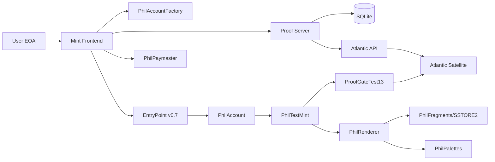
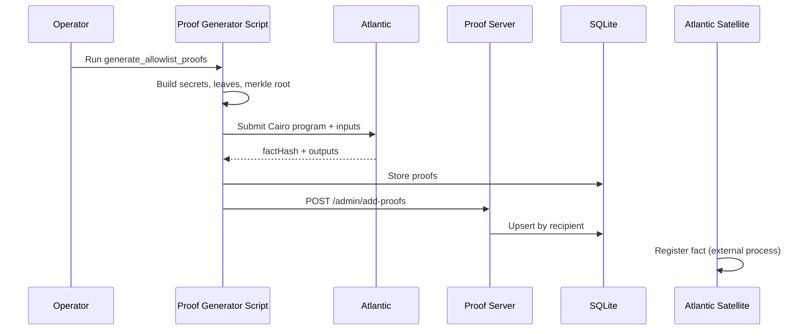
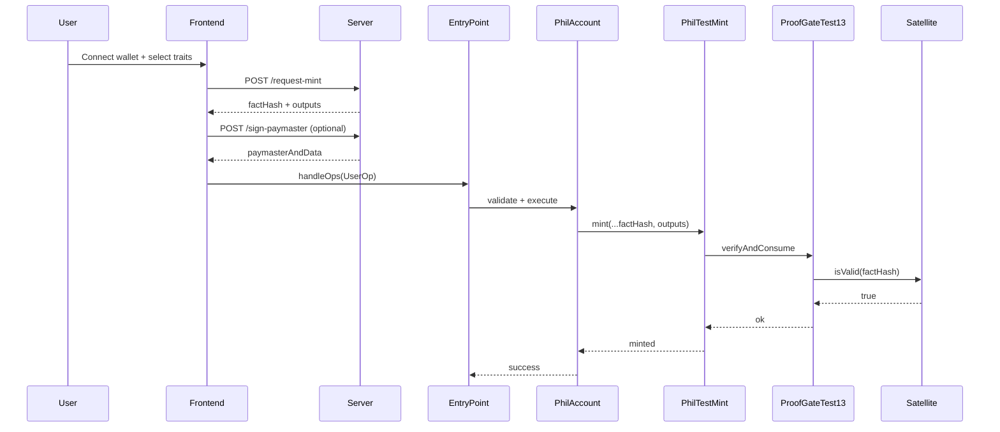

# philCodex Specification (SPEC)

## Executive Summary
philCodex is an end-to-end NFT minting system that combines on-chain generative art, STARK allowlist proofs, and EIP-4337 Smart Accounts with optional gas sponsorship.

The system has four primary planes:
1. **Frontend minting UX** that renders deterministic NFT previews from local fragments and submits mint transactions.
2. **Backend proof/paymaster server** that serves pre-generated allowlist proof payloads, computes deterministic Smart Account addresses, and signs paymaster sponsorship approvals.
3. **On-chain Ethereum contracts** for minting, proof verification, rendering, account abstraction, and wallet policy enforcement.
4. **Cairo/Atlantic proof pipeline** that generates STARK facts tied to allowlist membership and recipient identity.

This document defines the product and technical specification for productionizing that architecture while preserving current repository behavior where relevant.

---

## Project Overview
### Purpose
Enable users to mint one of 13 on-chain “Phil” NFTs only if they have a valid STARK allowlist proof, with onboarding through deterministic Smart Accounts.

### Repository Scope (as implemented)
- Solidity contracts for minting, rendering, proof gating, ERC-4337 account, paymaster, and unlock inbox.
  - `contracts/PhilTestMint.sol`
  - `contracts/ProofGateTest13.sol`
  - `contracts/PhilAccount.sol`
  - `contracts/PhilAccountFactory.sol`
  - `contracts/PhilPaymaster.sol`
  - `contracts/PhilUnlockInbox.sol`
  - `contracts/PhilRenderer.sol`
  - `contracts/PhilFragments.sol`
  - `contracts/PhilPalettes.sol`
  - `contracts/PhilWeb3.sol`
- Backend Fastify server for proof serving and AA support.
  - `server-ts/src/index.ts`
  - `server-ts/src/routes/*.ts`
- Cairo allowlist verification program.
  - `cairo/src/lib.cairo`
  - `cairo/src/allowlist.cairo`
- Frontend preview + mint flows.
  - `frontend/index.html`
  - `frontend/mint.html`
  - `frontend/app.js`
  - `frontend/mint.js`
  - `frontend/userop.js`
  - `frontend/starkKey.js`
- Deployment and operational scripts.
  - `scripts/deploy_stark.mjs`
  - `scripts/deploy_4337.mjs`
  - `server-ts/scripts/generate_allowlist_proofs.ts`

### Product Goals
1. Enforce allowlist eligibility using STARK facts and nullifier replay protection.
2. Mint to Smart Accounts by default, while proof recipient remains EOA-bound.
3. Keep NFT art fully on-chain (fragments + palettes + renderer + tokenURI).
4. Allow gas sponsorship for minting through a backend-controlled paymaster signer.
5. Provide optional STARK unlock ticket controls for sensitive wallet actions.

### Out-of-Scope (high level)
- Full decentralized proof generation in-browser.
- Generalized account recovery UX.
- Multi-chain deployment beyond local Hardhat testing.

---

## Feature List & Requirements
### Functional Requirements

#### FR-1: STARK-Gated Minting
- Minting MUST require `(factHash, outputs[6])` validated against:
  - Program hash
  - Drop ID
  - Merkle root
  - Recipient address
- Nullifiers MUST be one-time consumable on-chain.
- Source of truth:
  - `contracts/ProofGateTest13.sol`
  - `contracts/PhilTestMint.sol`

#### FR-2: NFT Supply and Trait Constraints
- Max supply MUST be 13.
- `decalId` MUST be unique across minted tokens.
- Palette range MUST be 0..12.
- Outline range MUST be 0..3.
- Shape IDs MUST match deployed shape counts in `PhilFragments`.

#### FR-3: Smart Account Onboarding
- System MUST derive deterministic Smart Account address from `(EOA owner, starkPubKeyX)`.
- First mint MUST support undeployed accounts (initCode path).
- Proof-bound `recipient` and token receiver `mintTo` MUST satisfy:
  - `mintTo == recipient`, OR
  - `mintTo` is a contract reporting `isOwner(recipient) == true`.
- Account policy MUST enforce owner checks and scope-based unlock requirements.
- Source of truth:
  - `contracts/PhilAccountFactory.sol`
  - `contracts/PhilAccount.sol`
  - `frontend/mint.js`

#### FR-4: Paymaster Sponsorship
- Backend MUST only sign sponsorship for approved mint-related UserOperations.
- Paymaster MUST validate backend signature, validity window, and sponsored call policy in-contract.
- Sponsored UserOperation MUST be:
  - `execute(address,uint256,bytes)` call on the Smart Account,
  - `target == PhilTestMint`,
  - `value == 0`,
  - inner selector `mint(...)`,
  - `mintTo == userOp.sender`.
- Sponsorship MUST be bounded by time (`validAfter`, `validUntil`).
- Source of truth:
  - `server-ts/src/routes/signPaymaster.ts`
  - `contracts/PhilPaymaster.sol`

#### FR-5: Proof Serving API
- Backend MUST return allowlist proof payload by recipient address.
- Payload MUST include `factHash`, `outputs`, `nullifier`, `dropId`, `programHash`, `merkleRoot`.
- Backend MUST reject malformed or context-mismatched stored proofs before serving.
- Admin APIs MUST support proof ingestion and proof generation workflows.
- Source of truth:
  - `server-ts/src/routes/requestMint.ts`
  - `server-ts/src/routes/admin.ts`
  - `server-ts/src/lib/db.ts`

#### FR-6: On-Chain Rendering
- Token URI MUST be generated on-chain and reference on-chain SVG composition.
- Renderer MUST support both full embedded data URI mode and compact web3:// mode.
- Source of truth:
  - `contracts/PhilRenderer.sol`
  - `contracts/PhilWeb3.sol`

#### FR-7: STARK Unlock Ticket Integration (Wallet Policy)
- Wallet MUST optionally require unlock tickets for configured sensitive scopes.
- Unlock tickets MUST be read from L1 inbox and time/scope validated.
- Source of truth:
  - `contracts/PhilUnlockInbox.sol`
  - `contracts/PhilAccount.sol`
  - `frontend/mint.js` security panel

### Non-Functional Requirements
- **Security:** replay resistance, signature validation, minimal trust surface.
- **Availability:** proof server should remain responsive for mint windows.
- **Integrity:** deterministic account address and deterministic trait rendering.
- **Observability:** status endpoint + logging for mint/proof/sponsorship actions.
- **Performance:** user mint flow should complete in <60s on local Hardhat under nominal conditions.

### Canonical Cross-Layer Rules
1. **Outputs shape and order (authoritative):**
   - `outputs` MUST be length 6.
   - `outputs[0]=root`, `outputs[1]=drop_id`, `outputs[2]=recipient`, `outputs[3]=nullifier`, `outputs[4]=leaf`, `outputs[5]=idx`.
2. **Type system and serialization:**
   - Every output is treated as `uint256` in Solidity/server encoding.
   - Address-to-output mapping uses `uint256(uint160(address))` (left zero-padded to 32 bytes).
   - `PROGRAM_HASH` is treated as `bytes32` (left zero-padded if shorter when supplied off-chain).
   - Endianness is EVM canonical big-endian for integer byte representation.
3. **Fact hash preimage (authoritative):**
   - `outputHash = keccak256(abi.encodePacked(uint256[6] outputs))`
   - `factHash = keccak256(abi.encode(bytes32 PROGRAM_HASH, bytes32 outputHash))`
4. **Mint binding invariants:**
   - Proof recipient (`outputs[2]`) binds to `recipient` parameter.
   - `mintTo` may differ from `recipient` only when `mintTo.isOwner(recipient) == true`.
   - Sponsored mint requires `mintTo == userOp.sender`.
5. **Access control invariants:**
   - `ProofGateTest13.verifyAndConsume` callable only by configured mint contract.
   - Nullifier is burned only after output checks, factHash recomputation, and Satellite validity check.
6. **Versioning invariants:**
   - Proof identity context is `(dropId, programHash, merkleRoot)`.
   - Server DB and APIs MUST be context-aware for multi-drop coexistence.
7. **Failure semantics:**
   - `/request-mint` machine error codes: `PROOF_NOT_FOUND`, `PROOF_PAYLOAD_INVALID`, `PROOF_CONTEXT_MISMATCH`, `PROOF_RECIPIENT_MISMATCH`, `PROOF_NULLIFIER_MISMATCH`, `FACT_HASH_MISMATCH`.
   - `/sign-paymaster` machine error codes include: `UNSUPPORTED_CALLDATA`, `INVALID_EXECUTE_ENCODING`, `UNSUPPORTED_TARGET`, `UNSUPPORTED_INNER_CALL`, `INVALID_MINT_ENCODING`, `MINT_TO_SENDER_MISMATCH`.

---

## Architecture Overview (Frontend, Backend, Chain, Proof System)
### Component Responsibilities

#### Frontend
- Renders local SVG fragment previews.
- Connects wallet, computes Smart Account, fetches proof, builds/signs UserOp, and submits mint.
- Handles optional account controls: scope mask updates, owner adds, ticket view.
- Files:
  - `frontend/mint.js`
  - `frontend/userop.js`
  - `frontend/starkKey.js`

#### Backend
- Fastify service exposing proof + AA helper endpoints.
- Stores proofs and secrets in SQLite.
- Integrates with Atlantic for proof generation.
- Files:
  - `server-ts/src/index.ts`
  - `server-ts/src/routes/*.ts`
  - `server-ts/src/lib/*.ts`

#### Chain (Ethereum)
- `PhilTestMint`: ERC721 mint + native marketplace + royalty hooks.
- `ProofGateTest13`: validates fact hash + outputs + Atlantic satellite, burns nullifier.
- `PhilAccount` ecosystem: account, factory, paymaster, unlock inbox.
- Renderer stack: palettes + fragments + renderer + ERC-4804 gateway.

#### Proof System (Cairo + Atlantic)
- Cairo program verifies Merkle membership and computes nullifier.
- Atlantic generates and registers fact.
- Ethereum gate checks fact validity via Satellite.

### High-Level System Diagram


### Trust Boundaries
1. Browser/user device.
2. Backend server and secrets.
3. Atlantic external proving service.
4. Immutable on-chain verification and state transitions.

---

## User Flows (Minting, Wallet/Smart Account Creation, Proof Submission)
### Flow A: Wallet + Smart Account Creation
1. User connects EOA wallet in frontend.
2. Frontend generates or loads local STARK keypair from `localStorage`.
3. Frontend requests `/compute-account` with `(eoa, starkPubKeyX)`.
4. Backend calls `PhilAccountFactory.getPhilAddress` and returns deterministic Smart Account address.
5. Frontend checks account deployment state (`provider.getCode`).

### Flow B: Minting (EIP-4337 path)
1. User selects generated Phil traits.
2. Frontend requests `/request-mint` with EOA recipient.
3. Backend returns `factHash + outputs[6] + nullifier + drop context (dropId/programHash/merkleRoot)`.
4. Frontend builds UserOperation:
   - target = `PhilTestMint`
   - calldata = `mint(recipient=eoa, mintTo=smartAccount, ...)`
   - initCode only if account undeployed
5. Frontend optionally requests `/sign-paymaster`.
6. Frontend signs UserOp hash with EOA.
7. Submit via bundler RPC (if configured) or directly to `EntryPoint.handleOps`.
8. On-chain:
   - `PhilAccount` validates owner signature and policy
   - `PhilTestMint.mint` calls `ProofGateTest13.verifyAndConsume`
   - proof gate validates outputs/fact/satellite and burns nullifier
   - NFT minted to Smart Account

### Flow C: Proof Generation + Submission (Admin/Ops)
1. Operator provides allowlist addresses.
2. `generate_allowlist_proofs.ts` generates secrets, leaves, Merkle tree, and Atlantic proofs (or fake proofs).
3. Proofs persisted to local DB and optional server upload via `/admin/add-proofs`.
4. Frontend consumers retrieve proofs per recipient via `/request-mint`.

---

## Data Flow Diagrams
### DFD-1: Proof Lifecycle


### DFD-2: Mint Execution


### ASCII: Trait and Rendering Data Path
```text
Fragments/*.frag.svg -> SSTORE2 pointers -> PhilFragments
                                      \-> DSL flags -> PhilDSLDecoder
Palettes (bytes3 structs) ------------------------------> PhilPalettes
PhilRenderer + (fragments + palettes + trait IDs) ------> SVG/tokenURI
```

---

## API Specifications (Backend + Smart Contract Interfaces)
### Backend API (Fastify)
Base URL: `http://<host>:8787`

#### Public Endpoints
1. `GET /health`
- Response: `{ status: "ok" }`

2. `GET /status`
- Response fields:
  - `status`
  - `merkleRoot` (configured active drop root)
  - `treeMerkleRoot` (root computed from local DB leaves)
  - `dropId`
  - `programHash`
  - `totalSecrets`, `availableSecrets`, `usedSecrets`, `totalProofs`, `treeDepth`

3. `GET /root`
- Response: `{ root: <hex> }`

4. `POST /request-mint`
- Request: `{ recipient: 0x<40-hex-address> }`
- Success: `{ success: true, factHash, outputs[6], nullifier, dropId, programHash, merkleRoot }`
- Failure: `{ success: false, code, error }`

5. `POST /compute-account`
- Request: `{ eoa, starkPubKeyX }`
- Success: `{ success, smartAccount, eoa, starkPubKeyX }`

6. `POST /sign-paymaster`
- Request fields:
  - `sender`, `nonce`, `initCode`, `callData`, `accountGasLimits`, `preVerificationGas`, `gasFees`
- Behavior:
  - validates `callData` is `execute(address,uint256,bytes)`
  - enforces `target == PhilTestMint` and `value == 0`
  - enforces inner calldata selector is `mint(...)`
  - enforces `mintTo == sender`
  - signs hash compatible with `PhilPaymaster.getHash`
- Response: `{ success, paymasterAndData, validUntil, validAfter }` or `{ success: false, code, error }`

#### Admin Endpoints (Require `adminKey` in body)
1. `POST /admin/add-proof`
2. `POST /admin/add-proofs`
3. `POST /admin/generate-secrets`
4. `POST /admin/stats`
5. `POST /admin/clear-reservations`
6. `POST /admin/add-secret`

### Database Schema (Server)
- `secrets`
  - secret material, leaf, leaf index, reservation/use metadata
- `allowlist_proofs`
  - composite primary key: `(recipient, drop_id, program_hash, merkle_root)`
  - fields: `fact_hash`, `outputs`, `nullifier`, `created_at`
- File: `server-ts/src/lib/db.ts`

### Smart Contract Interfaces (Primary)

#### `PhilTestMint`
- Mint:
  - `mint(recipient, mintTo, paletteId, decalId, outlineId, spikesShape, bodyShape, teethShape, factHash, outputs[6])`
  - Invariant: if `mintTo != recipient`, then `mintTo.isOwner(recipient)` MUST be true.
- Read:
  - `totalSupply()`, `decalUsed(uint8)`, trait mappings, `tokenURI(tokenId)`
- Marketplace:
  - `offerForSale`, `offerForSaleToAddress`, `cancelOffer`, `buy`, `enterBid`, `withdrawBid`, `acceptBid`, `withdraw`

#### `ProofGateTest13`
- `verifyAndConsume(recipient, factHash, outputs[6])`
- `nullifierUsed(bytes32)`
- Immutables: `PROGRAM_HASH`, `DROP_ID`, `MERKLE_ROOT`, `mintContract`, `satellite`

#### `PhilAccountFactory`
- `createPhilAccount(owner, starkPubKeyX)`
- `getPhilAddress(owner, starkPubKeyX)`
- `computeSalt(owner, starkPubKeyX)`

#### `PhilAccount`
- Owner/state management:
  - `addOwner`, `removeOwner`, `setStarkScopeMask`, `setLargeSpendWei`, `setUnlockInbox`
- AA execution:
  - `execute`, `executeBatch`
- Read:
  - `ownerCount`, `isOwner`, `unlockInbox`, `starkScopeMask`

#### `PhilPaymaster`
- ERC-4337 hooks:
  - `validatePaymasterUserOp`, `postOp`
- Ops:
  - `deposit`, `withdraw`, `getDeposit`, `getHash`
- Policy:
  - Contract-enforced sponsorship restriction to `execute -> PhilTestMint.mint`.

#### `PhilUnlockInbox`
- `recordTicket(vault, nonce, validAfter, validUntil, scope, constraintsHash)`
- `getTicket(vault)`

#### Rendering Stack
- `PhilRenderer.renderSvg(...)`
- `PhilRenderer.tokenURI(...)`
- `PhilFragments.ptr/decalPtr/outlinePtr/...`
- `PhilPalettes.palette(id)`
- `PhilWeb3.read(path)`

---

## Proof System Design (STARK Circuits, Verifier Integration)
### Cairo Program Contract
Program: `cairo/src/lib.cairo` + `cairo/src/allowlist.cairo`

#### Inputs
- `secret`
- Merkle proof: `siblings[]`, `path_indices[]`
- Public values: `root`, `drop_id`, `recipient`

#### Outputs (exact order)
1. `root`
2. `drop_id`
3. `recipient`
4. `nullifier`
5. `leaf`
6. `idx` (proof depth proxy)

### Cryptographic Formulas
- `leaf = pedersen(DOMAIN_LEAF, secret)` where `DOMAIN_LEAF = 1`
- `nullifier = pedersen(DOMAIN_NULL, pedersen(secret, pedersen(drop_id, recipient)))` where `DOMAIN_NULL = 2`
- `factHash = keccak256(abi.encode(PROGRAM_HASH, keccak256(abi.encodePacked(outputs))))`

### Canonical Encoding Rules
1. `outputs` MUST be encoded exactly as six `uint256` values in this order: `[root, drop_id, recipient, nullifier, leaf, idx]`.
2. `abi.encodePacked(outputs)` means byte-concatenation of six 32-byte big-endian words.
3. `PROGRAM_HASH` MUST be encoded as `bytes32` in `abi.encode`.
4. Address recipient in outputs MUST be `uint256(uint160(recipientAddress))` left-padded to 32 bytes.
5. Any off-chain proof payload that cannot round-trip through these rules is invalid and MUST NOT be served.

### Fact Hash Test Vectors
Canonical vectors are stored in `shared/fact_hash_vectors.json` and enforced by tests.

Vector 1:
- `programHash`: `0x0123456789abcdef0123456789abcdef0123456789abcdef0123456789abcdef`
- `outputs`:
  - `0x00000000000000000000000000000000000000000000000000000000000000aa`
  - `0x0000000000000000000000000000000000000000000000000000000000000001`
  - `0x0000000000000000000000001111111111111111111111111111111111111111`
  - `0x00000000000000000000000000000000000000000000000000000000feedbeef`
  - `0x0000000000000000000000000000000000000000000000000000000000000042`
  - `0x0000000000000000000000000000000000000000000000000000000000000004`
- Expected `factHash`: `0xe568f9e9f8595df50e6aa7d9dcf65c01b922811fdd91f921bd073202e7a3caef`

Vector 2:
- `programHash`: `0xaaaaaaaaaaaaaaaaaaaaaaaaaaaaaaaaaaaaaaaaaaaaaaaaaaaaaaaaaaaaaaaa`
- `outputs`:
  - `0x1234567890abcdef1234567890abcdef1234567890abcdef1234567890abcdef`
  - `0x000000000000000000000000000000000000000000000000000000000000000d`
  - `0x0000000000000000000000002222222222222222222222222222222222222222`
  - `0x0f0e0d0c0b0a0908070605040302010000000000000000000000000000000000`
  - `0x00ffffffffffffffffffffffffffffffffffffffffffffffffffffffffffffff`
  - `0x0000000000000000000000000000000000000000000000000000000000000010`
- Expected `factHash`: `0x51c820891f650a6258cdfc9ebef95fb5d0239c62ae2fda06b7cafd9488e0dd4d`

### Verifier Integration Path
1. Cairo execution proven by Atlantic.
2. Atlantic registers fact on Satellite.
3. On mint, `ProofGateTest13` verifies:
   - output root == configured root
   - output drop_id == configured drop
   - output recipient == mint `recipient`
   - local recomputed factHash == supplied factHash
   - `satellite.isValid(factHash) == true`
   - nullifier unused, then marks used

### Proof Generation Pipeline Requirements
- Script MUST support real Atlantic proofs and fake proofs for test mode.
- Program hash MUST be computed and pinned pre-deploy.
- Merkle root MUST be synchronized between:
  - Cairo outputs
  - server env
  - deployed `ProofGateTest13`

### Drop / Root / Program Versioning
1. `ProofGateTest13` is immutable per drop context:
   - immutable `PROGRAM_HASH`
   - immutable `DROP_ID`
   - immutable `MERKLE_ROOT`
2. New drop or root/program update requires a new gate deployment (and mint deployment wired to it).
3. Server proof records are namespaced by `(recipient, drop_id, program_hash, merkle_root)` to support parallel drops.
4. `/request-mint` MUST return the same `(dropId, programHash, merkleRoot)` context used by that proof record.

---

## Smart Account Lifecycle & UX
### Lifecycle States
1. `Disconnected`
2. `EOA Connected`
3. `STARK Key Available` (generated or restored)
4. `Smart Account Computed` (`/compute-account`)
5. `Smart Account Undeployed` (code == `0x`)
6. `Smart Account Deployed` (after first successful handleOps/creation)
7. `Policy Hardened` (scope mask, owner count, unlock inbox/tickets)

### UX Requirements
- Wallet connect must clearly show:
  - EOA address
  - Smart Account address
  - deployment status badge
- Mint CTA enabled only when:
  - wallet connected
  - a valid unminted configuration selected
  - not currently minting
- Security panel should support:
  - scope toggles
  - owner add
  - unlock payload builder
  - ticket refresh/readability

### Policy Semantics
- Trading-sensitive actions require minimum owner count (`MIN_OWNERS_FOR_TRADING = 2`).
- Actions in configured `starkScopeMask` require valid unlock ticket.
- Unlock ticket validity checks:
  - scope inclusion
  - time window
  - optional constraints hash match

---

## Security & Threat Modeling
### Assets to Protect
1. Allowlist eligibility integrity.
2. Nullifier one-time semantics.
3. Paymaster signer key.
4. Admin key and proof DB integrity.
5. Smart Account ownership and policy state.

### Threats and Mitigations

#### T1: Proof Replay
- Risk: repeated use of same proof payload.
- Mitigation: on-chain `nullifierUsed` burn in `ProofGateTest13`.

#### T2: Forged Fact Hash
- Risk: attacker submits mismatched outputs/fact.
- Mitigation: on-chain recomputation + Satellite validation.

#### T3: Sponsorship Abuse
- Risk: paymaster funds non-mint calls.
- Mitigation: backend validates request payload before signing; paymaster enforces `execute->PhilTestMint.mint`, `value==0`, and `mintTo==sender` in-contract.
- Residual risk: signer key compromise can still authorize policy-compliant abusive volume (operational monitoring/limits required).

#### T4: Admin API Abuse
- Risk: unauthorized proof insertion or state tampering.
- Mitigation: `adminKey` gate.
- Residual risk: key is sent in request body; add TLS + rotation + rate limiting.

#### T5: Data Model Collisions
- Risk: multiple proofs for same EOA overwritten (`recipient` PK).
- Mitigation: schema keyed by `(recipient, drop_id, program_hash, merkle_root)` to support multi-drop proofs per recipient.

#### T6: Frontend/Contract Trait Mismatch
- Risk: frontend generates shape IDs unsupported by current contract ranges.
- Mitigation: frontend now clamps minted shape IDs to deployed on-chain range (`0` for current spikes/body/teeth shape sets).

#### T7: Supply/Status Misleading UX
- Risk: preview mode displays `0 / ∞` while on-chain supply is finite.
- Mitigation: mint page reads on-chain `totalSupply` and `decalUsed` state before enabling mint.

### Security Controls (Required)
1. Secrets in env only, never committed.
2. CORS origin restriction in production.
3. HTTPS-only deployment for backend.
4. Monitoring for failed paymaster signatures and repeated admin failures.
5. Formalized key rotation process (admin and paymaster signer).

---

## Testing Strategy & Acceptance Criteria
### Test Layers
1. **Unit Tests**
- Merkle and nullifier math (`server-ts/src/lib/merkle.ts`)
- factHash computation (`server-ts/src/lib/factHash.ts`)
- policy scope mapping (`contracts/PhilAccount.sol`)
- paymaster hash parity (server vs contract)

2. **Contract Integration Tests**
- `PhilTestMint` mint path with valid and invalid proofs.
- nullifier replay rejection.
- trait bounds and supply cap behavior.
- marketplace and royalty accounting.

3. **Server Route Tests**
- schema validation and error contracts.
- `/request-mint` correctness and proof length checks.
- `/sign-paymaster` target validation.
- admin route authorization.

4. **E2E Tests**
- wallet connect → compute account → mint via 4337.
- first mint undeployed account path.
- paymaster-sponsored and self-pay variants.
- STARK unlock scope enforcement and ticket window checks.

5. **Operational Tests**
- deployment smoke checks.
- root synchronization check (`scripts/check_merkle_root.mjs`).
- fact validation smoke check (`scripts/verify_fact_hash.mjs`).

### Acceptance Criteria
- AC-1: Valid proof mint succeeds and mints to Smart Account.
- AC-2: Reusing same nullifier fails.
- AC-3: Invalid outputs root/drop/recipient fail.
- AC-4: Non-SmartAccount `execute` userOps are not sponsored by backend.
- AC-5: Undeployed account can mint via initCode path.
- AC-6: Account policy blocks configured protected actions without valid ticket.
- AC-7: Renderer returns deterministic SVG for identical trait inputs.
- AC-8: Deployment artifacts and server env resolve to same contract addresses.

---

## Deployment Plan
### Environments
1. Local Hardhat (authoritative local-only mode)

### Prerequisites
- Compiled Cairo program + stable `PROGRAM_HASH`.
- Generated allowlist proofs + synchronized `MERKLE_ROOT`.
- Configured env variables in root and `server-ts`.

### Deployment Sequence
1. `npm run compile`
2. Deploy core STARK stack:
   - `node scripts/deploy_stark.mjs`
3. Deploy AA stack:
   - `node scripts/deploy_4337.mjs`
4. Sync server env with deployment outputs.
5. Start backend server (`server-ts`).
6. Run smoke checks:
   - `/health`, `/status`
   - `/compute-account`
   - `/request-mint`
   - mint dry-run with test wallet

### Post-Deployment Verification
- Contract addresses persisted in:
  - `deployments/stark_<chainId>.json`
  - `deployments/4337_<chainId>.json`
- Proof server status root matches on-chain `MERKLE_ROOT`.
- Paymaster has sufficient deposit balance.
- Frontend points to correct server and deployment JSONs.

### Rollback Strategy
- If backend issues: deploy previous server version and keep chain immutable state.
- If proof root mismatch: halt mint UI, regenerate proofs, redeploy gate/mint stack for new drop.
- If paymaster abuse risk: rotate signer and/or pause sponsorship path at backend.

---

## Non-Goals / Known Risks
### Non-Goals
1. Supporting unlimited trait variants in current drop.
2. Production-grade decentralized bundler integration out of the box.
3. Off-chain metadata hosting.
4. Generic cross-chain STARK verification support.

### Known Risks (Current Repository)
1. Admin auth still relies on request-body `adminKey`; stronger authn/z and rotation policy are required for internet-facing deployments.
2. Backend still assumes trusted upstream source for Atlantic fact registration latency; users may receive valid payload before Satellite registration finality.
3. Several legacy scripts are retained and may diverge from canonical contract interfaces if not regularly exercised.
4. In-memory rate limiting is process-local; multi-instance deployments require shared/distributed rate limiting.
5. TLS termination and network perimeter controls are deployment responsibilities and not enforced by repository code alone.

---

## Test-Ready Specification Checklist
- [ ] Verify Cairo output ordering and length exactly equals 6 fields.
- [ ] Verify `factHash` recomputation parity between server and `ProofGateTest13`.
- [ ] Verify mint fails when `outputs[0] != MERKLE_ROOT`.
- [ ] Verify mint fails when `outputs[1] != DROP_ID`.
- [ ] Verify mint fails when `outputs[2] != recipient`.
- [ ] Verify mint fails for reused nullifier.
- [ ] Verify mint succeeds for valid `(factHash, outputs)` and unused decal.
- [ ] Verify max supply cap at 13.
- [ ] Verify `decalId` cannot be reused.
- [ ] Verify unsupported shape IDs revert.
- [ ] Verify `/request-mint` rejects non-allowlisted recipients.
- [ ] Verify `/request-mint` returns strict schema (`factHash`, 6 outputs, `nullifier`, `dropId`, `programHash`, `merkleRoot`).
- [ ] Verify `/compute-account` deterministically matches on-chain factory.
- [ ] Verify `/sign-paymaster` rejects non-`execute(...)` calldata.
- [ ] Verify `/sign-paymaster` rejects targets other than `PhilTestMint`.
- [ ] Verify `/sign-paymaster` rejects inner non-`mint(...)` calls and `mintTo != sender`.
- [ ] Verify `PhilPaymaster` validates backend signature and validity windows.
- [ ] Verify first UserOp can deploy account via initCode path.
- [ ] Verify `PhilAccount` enforces owner signature in `_validateSignature`.
- [ ] Verify configured `starkScopeMask` actions require valid unlock ticket.
- [ ] Verify ticket nonce monotonicity in `PhilUnlockInbox.recordTicket`.
- [ ] Verify renderer determinism for identical trait tuple.
- [ ] Verify `MERKLE_ROOT` consistency between server and deployed gate.
- [ ] Verify deployment artifacts match runtime contract addresses used by frontend/server.
